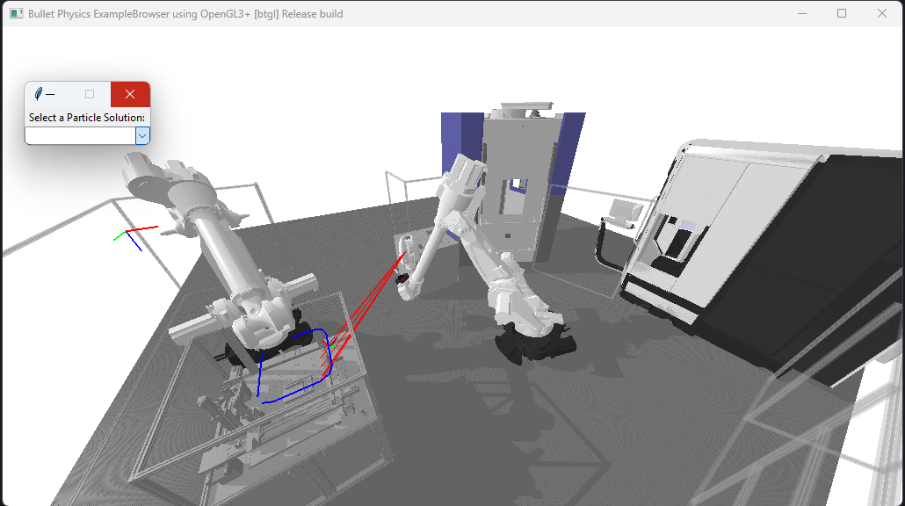

# Laser Tracker Placement Optimization

This repository contains the code for the paper "Laser tracker placement optimization for highly flexible
manufacturing systems".

It provides the code to reproduce the results of the paper, as well as the ability to run optimize laser tracker placements for yor own systems.

## Installation

The code is implemented as a simple python script and requires the packages in the `requirements.txt` file. To install the required packages, run the following command:

```bash
pip install -r requirements.txt
```

## Usage

### Reproduce the results

To reproduce the results of the paper, run the  `paper_experiments.py` script. This script will run the optimization for the different scenarios and save the results in the `results` folder:

```bash
python code/paper_experiments.py
```

To generate a plot of the objective function over the number of iterations, run the `paper_evaluation.py` script:

```bash
python code/paper_evaluation.py
```

To visually explore the results, run the `paper_visualization.py` script:

```bash
python code/paper_visualization.py
```

This code will open a simulation of the manufacturing system with the optimized laser tracker placements.
Since the particle swarm optimization algorithm may find multiple solution of similar quality, the script will allow you to explore the different solutions that are within a adjustable threshold of the best solution.




### Optimize your own system

To optimize your own system, you can use the `custom_optimization.py` script. This script allows you to specify the parameters of your system and run the optimization.
The comments in the script provide guidance on how to specify the parameters of your system.
The main functions the user needs to implement are the 'setup_cell' and 'run_simulation' functions, which describe the design of the cell and what the roboto does in the cell, respectively.
After implementing these functions, you can run the optimization with the following command:
```bash
python code/custom_optimization.py
```

Visualizing the results is done in the same way as for the paper results, by running the `paper_visualization.py` script.
The Evaluation script can also be used to evaluate the convergence of the optimization algorithm.
